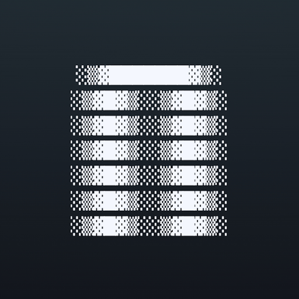

<div align="center">



# NOCTRA

A keyboard-first browser shell with a Neovim-style workflow.

_Current version:_ `0.0.3-alpha`

[About](#about) · [Installation](#installation) · [Documentation](#documentation) · [Contributing](#contributing) · [License](#license) · [Roadmap](#roadmap)

</div>

---

## About

Noctra is a keyboard-first browser shell that brings a Neovim-style workflow to web browsing.

It runs on Electron with the Chromium engine, treats tabs as buffers, and keeps modal interaction at the center of everything. Four modes drive the experience:

- `NORMAL` — navigate, scroll, and execute commands
- `INSERT` — interact with web content as usual
- `COMMAND` — run explicit commands (`:open`, `:tabnew`, `:buffer`, `:session save`, ...)
- `SEARCH` — run in-page search flows (`/`, `n`, `N`, hints)

Noctra is early-stage and actively evolving. Core browsing and modal workflows are usable, defaults are Vim-like with configurable leader mappings, and security checks are part of the standard CI gate. Commands, mappings, and APIs can still change between versions.

---

## Installation

Prebuilt releases are available on the [Releases](https://github.com/LightQv/noctra/releases) page.

| Platform | Format   | Notes                                                                        |
| -------- | -------- | ---------------------------------------------------------------------------- |
| macOS    | `.dmg`   | Drag to Applications. See the macOS tip below for first-launch instructions. |
| macOS    | `.zip`   | Portable archive.                                                            |
| Linux    | `.deb`   | Install with `sudo dpkg -i noctra_*.deb`.                                    |
| Linux    | `.rpm`   | Install with `sudo rpm -i noctra_*.rpm`.                                     |
| Linux    | AppImage | Run directly, then integrate once with `./Noctra-*.AppImage --integrate`.    |

```bash
curl -fsSL https://raw.githubusercontent.com/LightQv/noctra/main/scripts/install.sh | bash
```

> [!TIP]
> **macOS first launch**
>
> If you see _"Noctra.app is damaged and can't be opened"_ after installing from the `.dmg`, run this in Terminal:
>
> ```bash
> xattr -d com.apple.quarantine /Applications/Noctra.app
> ```
>
> _This happens because Noctra is not notarized. Notarization requires a paid Apple Developer account ($99/year), which is not currently set up. The command above removes the quarantine flag so the app can open normally._

### Installation Directory

User configuration is loaded from:

```
~/.config/noctra/config.yml
```

If missing, it is generated automatically with defaults and inline comments.

### AppImage integration and default browser

For AppImage builds, integrate Noctra into your desktop environment once:

```bash
./Noctra-*.AppImage --integrate
```

This writes `noctra.desktop` and icons into your user-local XDG directories and refreshes the desktop database. It does not force Noctra as default.

If needed, manual fallback:

```bash
xdg-mime default noctra.desktop x-scheme-handler/http
xdg-mime default noctra.desktop x-scheme-handler/https
```

#### Config sections

| Section                 | Purpose                                              |
| ----------------------- | ---------------------------------------------------- |
| `global.input`          | Leader key and sequence timeout                      |
| `global.ui`             | Shell UI toggles and panel behavior                  |
| `global.theme`          | App and content appearance                           |
| `keymap`                | User key mappings (`normal`/`mod`/`search`/`leader`) |
| `global.editor`         | Editable buffer behavior                             |
| `global.split`          | Split layout ratios and divider behavior             |
| `global.window`         | Initial window bounds and maximized state            |
| `global.storage`        | File locations for persisted data                    |
| `global.notifications`  | Toast and persistence behavior                       |
| `global.opening_buffer` | Startup mode and dashboard settings                  |

#### Persisted data

Each of the following gets its own persisted file, with paths defined under `global.storage`:

- **Sessions** — saved window and buffer state
- **Bookmarks** — user bookmark collection
- **History** — browsing history
- **Notifications** — notification log
- **Downloads** — download history and metadata

Apply config changes at runtime with `:config-reload`.

---

## Documentation

### Getting Started

- [Getting Started](docs/getting-started.md)
- [Tutorial: First 30 Minutes](docs/tutorials/first-30-minutes.md)

### User Reference

- [Keybindings](docs/keybindings.md)
- [Commands](docs/commands.md)
- [Configuration](docs/configuration.md)
- [Password Managers](docs/password-managers.md)

### Deep Dive

- [Architecture](docs/architecture.md)
- [Architecture Map](docs/architecture-map.md)
- [Intent Contract](INTENTS.md)
- [Intent Lifecycle](docs/intent-lifecycle.md)
- [Testing Guide](docs/testing.md)
- [IPC Security Checklist](docs/ipc-security-checklist.md)
- [FAQ](docs/faq.md)
- [Security Policy](SECURITY.md)
- [Release Checklist](docs/release-checklist.md)
- [Release Hygiene Status](docs/release-hygiene-status.md)

### Tutorials

- [Customize Leader Keymap](docs/tutorials/customize-keymap.md)
- [Sessions, History, and Bookmarks](docs/tutorials/sessions-history-bookmarks.md)

---

## Contributing

See [CONTRIBUTING.md](CONTRIBUTING.md) for development setup, contribution principles, commit style, and pull request guidelines.

---

## License

Noctra source code is licensed under the MIT License. See [LICENSE](LICENSE).

Extension-enabled builds include `electron-chrome-extensions@4.9.0`, which Noctra uses under GPL-3.0 through the selected GPL-compatible distribution path. These builds are not MIT-only distributions. See [THIRD_PARTY_NOTICES.md](THIRD_PARTY_NOTICES.md) for bundled notices and third-party licensing details.

---

## Roadmap

1. [ ] **Enhance modern browser behavior**
   - [ ] Embedded ad-blocker (enable/disable through config.yml)
   - [ ] Curated extension catalog with modal-based install/enable/disable lifecycle for Noctra-approved extensions only
   - [ ] Web compatibility layer improvements (site quirks, auth flows, clipboard/permissions parity)

2. [ ] **CLI support** — Basic actions: open, quit, focus, list-window, list-session, change workspace, search, and more.
